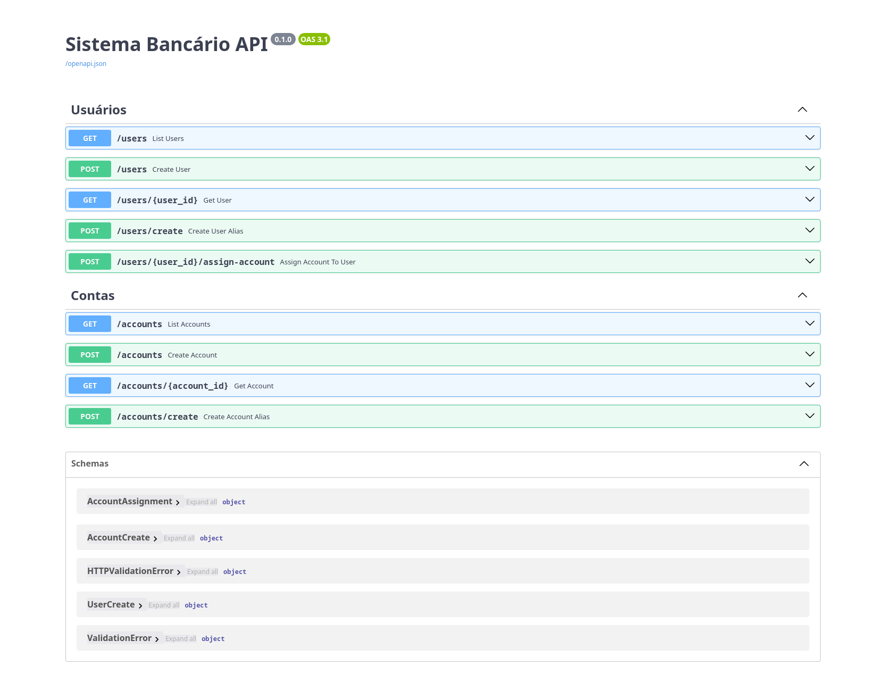

# Site portfolio




> Uma rest API feita com fastapi que simula um sistema bancário

## 💻 Pré-requisitos

Antes de começar, verifique se você atendeu aos seguintes requisitos:

- Ter o `git`, `python`, `pip` ou `uv` instalado

> [!NOTE]
> Recomendo usar o uv, [clique aqui](https://docs.astral.sh/uv/getting-started/installation/) para um guia de instalação

## 🚀 Instalando

Para instalar, siga estas etapas:

> [!WARNING]
> abra o seu terminal, crie ou entre em alguma pasta que servira para clonar o repositório sem bagunçar seus arquivos

Linux macOS e Windows:

```shell
git clone https://github.com/JorgeLineZin/sistema-bancario-api.git
```

## ☕ Rodando

Para usar, siga estas etapas:

**Com `pip`**

1. Criar e ativar um ambiente virtual

    ```shell
    python -m venv .venv
    ```

    No Windows

    ```shell
    .venv\Scripts\activate
    ```

    No Linux / macOS

    ```bash
    source .venv/bin/activate
    ```

2. Baixar dependências

   ```shell
   pip install pip-tools
   pip-compile pyproject.toml -o requirements.txt
   pip install -r requirements.txt
   ```

**Com `uv`**

```shell
uv sync
```

## 📫 Contribuindo

Para contribuir, siga estas etapas:

1. Bifurque este repositório.
2. Crie um branch: `git checkout -b <nome_branch>`.
3. Faça suas alterações e confirme-as: `git commit -m '<mensagem_commit>'`
4. Envie para o branch original: `git push origin <nome_do_projeto> / <local>`
5. Crie a solicitação de pull.

Como alternativa, consulte a documentação do GitHub em [como criar uma solicitação pull](https://help.github.com/en/github/collaborating-with-issues-and-pull-requests/creating-a-pull-request).

## 👨‍💻 Criador

<table>
    <tr>
        <td>
          <a href="#" title="defina o título do link">
            <br>
        <sub>
          <a href="https://github.com/JorgeLineZin" target="_blank" rel="noopener noreferrer">
    Jorge Felipe
          </a>
        </sub>
      </a>
        </td>
    </tr>
</table>

## 📝 Licença

Esse projeto está sob licença. Veja o arquivo [LICENÇA](LICENSE) para mais detalhes.
